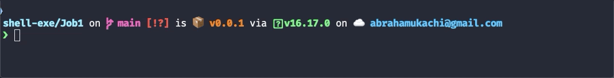

# Job 1
> - Author: [Abraham Ukachi](https://github.com/abraham-ukachi) 
> - Subject:[Shell-exe](https://github.com/abraham-ukachi/shell-exe)
> - School: [LaPlateforme\_](https://laplateforme.io)
> - Script: [myfirstscript.sh](./myfirstscript.sh)


## Description
  
En ligne de commande : \
Créer un fichier nommé myfirstscript.sh, écrivez à l'intérieur votre premier script : \
`echo` “i’m a script”\
Le mot clé “echo” permet d’afficher un texte et bien d’autres choses que vous verrez par
la suite…

Il faut maintenant donner les droits d'exécution à votre utilisateur. Une fois les droits
donnés, exécutez votre script.


## Command line usage

```sh
chmod +x myfirstscript.sh
```


```sh
./myfirstscript.sh
```


## Results
> NOTE: These are some giphy captures

### Making *myfirstscript.sh* file executable and running it



## Issues

Not Yet :)


## TODOs

- [ ] Optimize the [myfirstscript.sh](./myfirstscript.sh) script
- [ ] Remove unwanted comments

  
