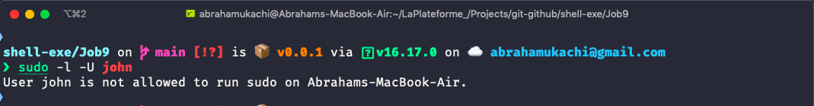
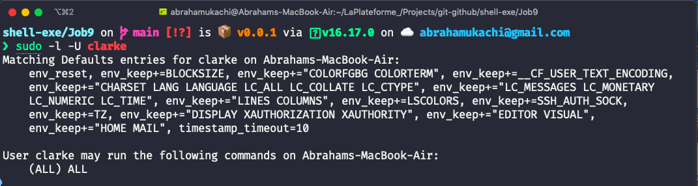
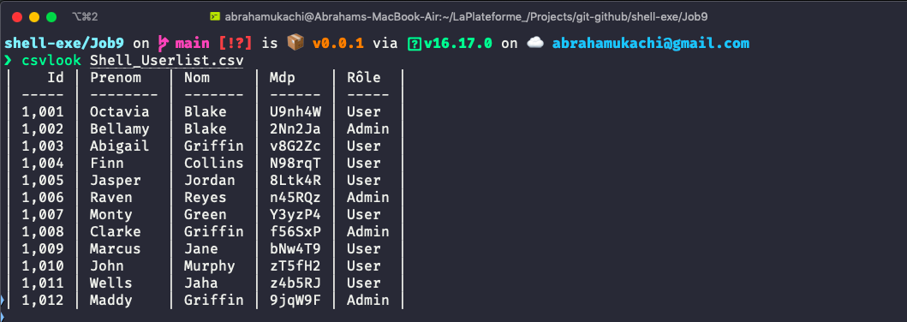

# Job 9
> - Author: [Abraham Ukachi](https://github.com/abraham-ukachi) 
> - Subject:[Shell-exe](https://github.com/abraham-ukachi/shell-exe)
> - School: [LaPlateforme\_](https://laplateforme.io)
> - Script: [accessrights.sh](./accessrights.sh)


## Description
> Original text in French: 
> Créer un script nommé accessrights.sh qui depuis ce fichier CSV, récupère les \
> informations des utilisateurs et les crée sur votre système. 
> Si l’utilisateur est un admin., donnez-lui le rôle de super utilisateur de votre système
> Pour la suite, utilisez les cron pour permettre au script de se relancer automatiquement
> s'il y a un changement dans le fichier CSV. (Pour tester, je vous invite à modifier le fichier à la main).


Create a script named **accessrights.sh** that from this CSV file, retrieves user information and creates it on your system. If the user is an admin, give him/her the role of super user of your system For the following, use cron to allow the script to restart automatically if there is a change in the CSV file. (To test, I'd like you to modify the file manually).


## Command line usage


```sh
./accessrights.sh [file] [option]
```

## Results

These are some giphy captures:

### Creating users on macOS using a `.csv` file
```sh
./accessrights.sh Shell_Userlist.csv
```


### Deleting users from macOS using a `.csv` file

```sh
./accessrights.sh Shell_Userlist.csv -r
```


## modicron

The [modicron file](modicron), located in this directory, is used to schedule a cron job with `crontab` that monitors a `.csv` file like [Shell_Userlist.csv](Shell_Userlist.csv) for any changes, and if the `.csv` file is altered or **modi**fied in anyway, the [accessrights.sh](accessrights.sh) script will be executed automatically. Sick, huh 😎? 

Enable *modicron* by entering the following command in a terminal:

```sh
crontab modicron
```
> NOTE: You should execute the above command from this [Job9](#Job9) folder. 

### Inside Modicron

```txt
* * * * * cd /path/to/Job9 && modifound=`find Shell_Userlist.csv -mmin -1` && [[ ${#modifound} > 0 ]] && ./accessrights.sh Shell_Userlist.csv
```
> The `-mmin -1` (option) tells `find` to return our csv file (ie. **Shell_Userlist.csv**) only if it has been modified in the last 60 seconds or 1 minute. You can check the [logs](.logs) to see if the **accessrights.sh** script was run by [modicron](#modicron) successfully.

## OS Support

The [accessrights.sh](./accessrights.sh) script won't work on all systems or terminals (definitely not on [Windows](https://microsoft.com)😝), but I'll try to make it compatible with at least [macoS](https://apple.com/macos), [debian](https://debian.org) and/or [Ubuntu](https://ubuntu.com). 

These are the operating systems currently supported:

| Name (OS) | Codename | Version | Tested |
| --------- | -------- | ------- | ------ |
| *`macOS`* | Mojave  | 10.14.6 | **YES** |

> IMPORTANT: The above list is a work in progress and subject to change 


## Issues

Not Yet ;)


## TODOs

- [x] Create an option (-r or --remove) to delete all previously created users.
- [ ] Create and **admin_list** array.
- [ ] Create a **create_user** function that can create a user on Debian and Ubuntu.
- [ ] Create a **delete_user** function that can delete a user on Debian and Ubuntu.
- [ ] Create a home directory for this new user (ie. NFSHOMEDIRECTORY) 
- [ ] Use the given **`id`** as primary group ID too ? 
- [ ] Add all users with `role = 'Admin'` to an **admin_list** array.
- [ ] Print out the total number of users created 
- [ ] Print out the total number of users deleted
- [ ] In `create_user_macos` function, do nothing if the user already exists.
- [ ] In `delete_usermacos` function, do nothing if the user has already been deleted.
- [ ] Trim the users' firstname/prenom
- [ ] Add [OS Support](#OS_Support) for [Debian](https://debian.org) and [Ubuntu](https://ubuntu.com)  
- [ ] Remove unwanted comments.
- [ ] Optimize the [accessrights.sh](./accessrights.sh) script.
- [ ] Catch the error caused when no or an incorrect `.csv` file is passed as an argument.


## Tips

These are a couple of **coding tips** related or birthed from this [job](#Job9):

### Tip 1 - Run the commands below to check if a user is a sudoer or currently has admin privileges:

```sh
sudo -l -U john
```


> NOTE: **john** is NOT a sudoer.

```sh
sudo -l -U clarke
```


> NOTE: **clarke** is a sudoer.

To learn more about *sudoers*, read this [wiki page from the Ubuntu community](https://help.ubuntu.com/community/Sudoers).


### Tip 2 - Run the command below to view a **'.csv'** file (ie. *Shell_Userlist.csv*) in a tabulated form:

```sh
csvlook Shell_Userlist.csv
```



> NOTE: You must have `csvlook` already installed.

---

**<-** Return to the [Previous Job](../Job8)

**->** Go to the [Next Job](../Job9+)
